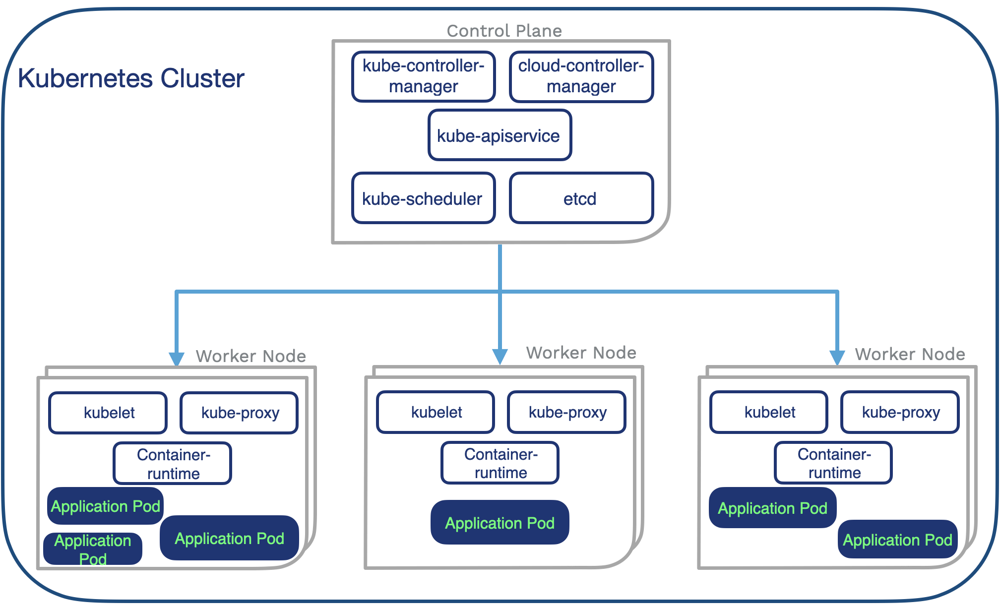
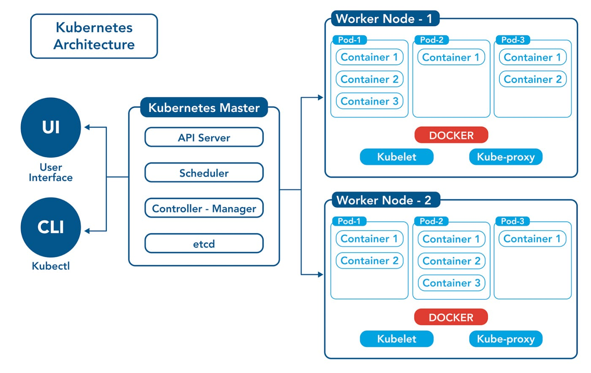
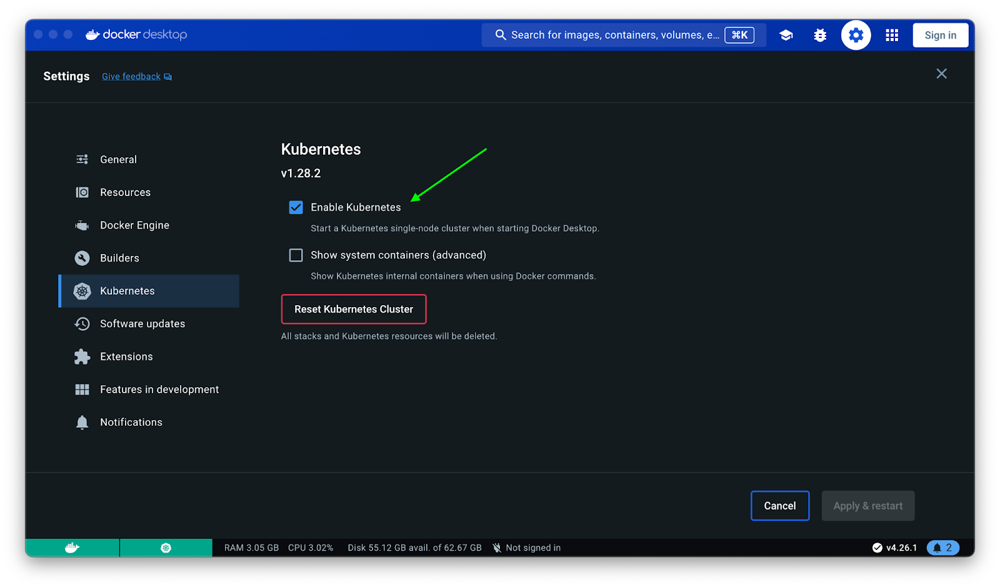
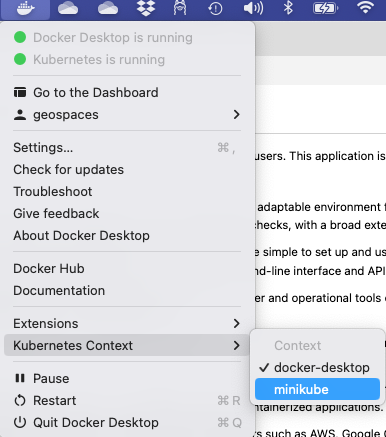

# Running application on Kubernetis

You already may have containerized your application. Now it is time to scale to thousands of users. This application is built to work on following orchestration engines:

1. Kubernetes, the top open-source container orchestration platform, offers a robust and adaptable environment for handling containerized applications. It automates tasks such as scaling, load balancing, and container health checks, with a broad extension ecosystem.

2. Docker Swarm is a container orchestration solution provided by Docker. Designed to be simple to set up and use, it’s a good choice for smaller applications or organizations already using Docker as it uses the same command-line interface and API as Docker.

3. OpenShift is an enterprise Kubernetes platform developed by Red Hat. It adds developer and operational tools on top of Kubernetes, simplifying the deployment and management of containerized applications.

4. Nomad, developed by HashiCorp, is a lightweight and user-friendly orchestrator capable of managing containers and non-containerized applications.

5. Apache Mesos is an open-source distributed system kernel, and DC/OS (data center operating system) is an enterprise-grade platform built on Mesos. DC/OS extends Mesos with additional features for managing and scaling containerized applications.

<figure>

<figcaption><b> Figure: overview of Kubernetis </b></figcaption>
</figure>

Software teams primarily work with managed platforms offered by well-known cloud providers such as AWS, Google Cloud Platform, and Azure. These cloud providers offer services like Amazon EKS, Google GKE, and Azure AKS, all of which are managed Kubernetes solutions. These services streamline the setup, expansion, and administration of Kubernetes clusters and seamlessly integrate with the respective cloud environments, ensuring efficient container orchestration and application deployment.


<br/>
<br/>

## Few considerations before you get started.

Since you will have multitude of instances and each instance may require a common location to share data. For ex. you may want to share the users logged in or common configuration files etc. 

Consider:

1. Using postgres for data and user management
2. Sketch common disk locations required by all instances
3. Consider how you will update all the instances instantaneously

------------------------------------------------------------------------------

## Lets get to it on minikube.

Keep the following picture while you read the remainder of the sections.


<br/>

1. Install minikube. Visit this site: 
[Mini kube installation.](https://minikube.sigs.k8s.io/docs/start/?arch=%2Fmacos%2Fx86-64%2Fstable%2Fbinary+download)

2. start minikube
```
# Start minikube

    minikube start

# See the dashboard

    minikube dashboard
# 
```
<br/>

* [Visit the interactive Dashboard](http://127.0.0.1:53603/api/v1/namespaces/kubernetes-dashboard/services/http:kubernetes-dashboard:/proxy/#/workloads?namespace=default)

### Deploy docker image onto kubernetis

If you have built your local docker image or pulled a image, you must have the image listed here.
Lets look into docker images you have

```
[ ~ ] 
    docker images ls

[ OUTPUT>>]

REPOSITORY            TAG                   IMAGE ID       CREATED        SIZE
geo-rhel9.21-base     latest                39dbe8a871c0   34 hours ago   1.52GB
geo-rhel9.21-django   latest                7364e7e9a17f   14 hours ago   2.03GB
sada001/geo           geo-rhel9.21-django   7364e7e9a17f   24 hours ago   2.03GB

```
Let deploy `sada001/geo:geo-rhel9.21-django ` as `k8-django`

```
# Create a variable - you can change and cut and run the remaining commands
[ ~ ]
    export MKSERVICE=k8-django
    export IMAGE=sada001/geo:geo-rhel9.21-django

    #=> In case you started one already:
    #kubectl delete -n default deployment ${MKSERVICE};kubectl delete -n default service ${MKSERVICE}

    kubectl create deployment ${MKSERVICE} --image=$IMAGE
    kubectl expose deployment ${MKSERVICE} --type=NodePort --port=8000

    # For balanced deployments

    export MKSERVICE=k8-django-balanced 
    kubectl create deployment ${MKSERVICE} --image=$IMAGE
    kubectl expose deployment ${MKSERVICE} --type=LoadBalancer --port=8000
```

#### To edit number of replicas 
```
    kubectl edit deployments.app/${MKSERVICE}  # Just change  the first instance of replicas:

[OUTPUT>>]  
    ...
    spec:
        progressDeadlineSeconds: 600
        replicas: 3
        revisionHistoryLimit: 10
        selector: 
    ...
```

------------------------------------------------------------------------------
Check the service is running 
```
[ ~ ] 
    kubectl get services ${MKSERVICE}

[OUTPUT>>]
    NAME        TYPE       CLUSTER-IP    EXTERNAL-IP   PORT(S)          AGE
    k8-django   NodePort   10.98.2.171   <none>        8000:31484/TCP   23s

[ ~ ] # This command will open a browser by tunnelling requests
    minikube service ${MKSERVICE}

[ OUTPUT>>]
    Browser will open and you can see your app @: http://127.0.0.1:55109

            minikube service ${MKSERVICE}
            |-----------|-----------|-------------|---------------------------|
            | NAMESPACE |   NAME    | TARGET PORT |            URL            |
            |-----------|-----------|-------------|---------------------------|
            | default   | k8-django |        8000 | http://192.168.49.2:31527 |
            |-----------|-----------|-------------|---------------------------|
            🏃  Starting tunnel for service k8-django.
            |-----------|-----------|-------------|------------------------|
            | NAMESPACE |   NAME    | TARGET PORT |          URL           |
            |-----------|-----------|-------------|------------------------|
            | default   | k8-django |             | http://127.0.0.1:55109 |
            |-----------|-----------|-------------|------------------------|

```

Forward to specific port:

```
    # If you wanted a different port
    # => 
    [ ~ ] 
        kubectl port-forward service/${MKSERVICE} 7080:8000

    # Access your server http://localhost:7080/
```


#### Running and creating images without having to push it globally

```
    eval $(minikube docker-env)

    #docker build .... <buid your umage>

    export TAGNAME=geo-echo1
    docker  build --tag=$TAGNAME -f Dockerfile-rhel9-cpu-kube-echo  .

    #kubectl run hello-foo --image=$TAGNAME --image-pull-policy=Never    

    export MKSERVICE=sample1

    kubectl create deployment ${MKSERVICE} --image=sada001/geo:geo-echo 
    kubectl expose deployment ${MKSERVICE} --type=NodePort --port=8000

    kubectl get services ${MKSERVICE}
    minikube service ${MKSERVICE}

```

------------------------------------------------------------------------------

## Lets get to it on Docker Desktop (Optional).

Here:

* We will deploy the django app to Docker desktop and test it.
* Once you have undersood the mechanics, you can deploy them to any kubernetis cluster.


=>



lets create a namespace:

```sh showLineNumbers
kubectl create ns django-app

OUT>>
    namespace/django-app created
```

TBD: The remainder section will be completed in future. Please see the next section for 
minikube deployment.

------------------------------------------------------------------------------

## When things go well

It is not always everything works perfectly well. One thing is to reset and restart everything from ground up.


------------------------------------------------------------------------------

## References:

1. https://blog.jetbrains.com/pycharm/2024/03/deploying-django-apps-in-kubernetes/
2. https://minikube.sigs.k8s.io/docs/start/?arch=%2Fmacos%2Fx86-64%2Fstable%2Fbinary+download
3. https://minikube.sigs.k8s.io/docs/start/ and install minikube
4. Quick intro to get started: https://www.youtube.com/watch?v=05BwSZ9elYI
5. https://github.com/dotja