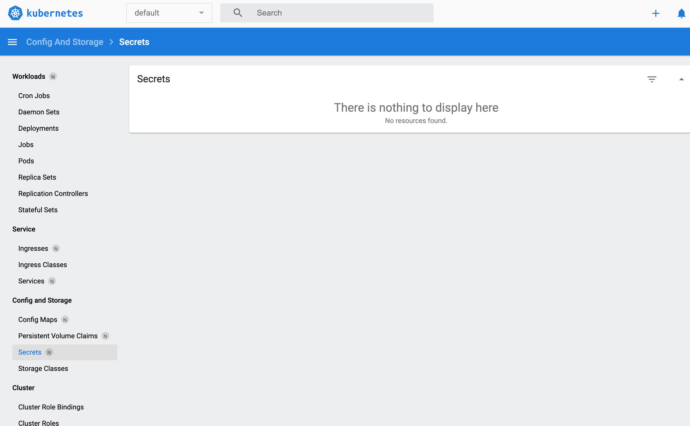
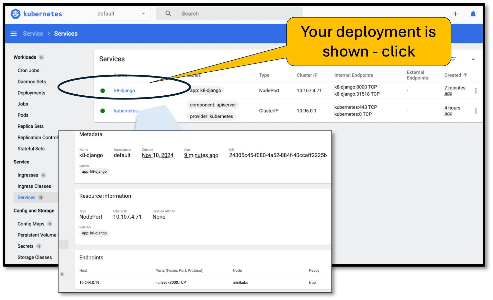
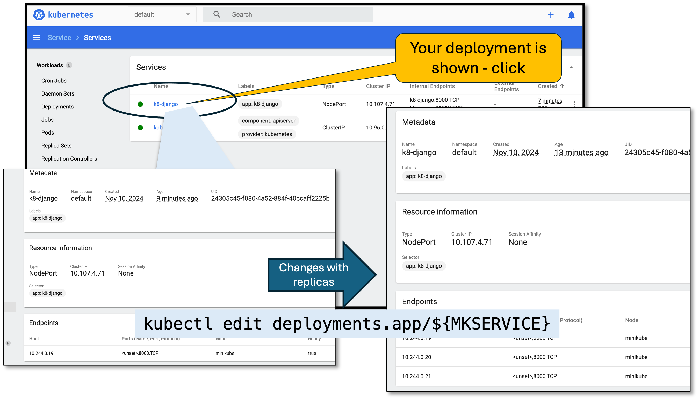

# Kubernetis advanced deployment.

You already created some kubernetis from previous section. Here we go deeper into kubernetis.

We look into:

* Minikube dashboard 
* Replicas
* Configmaps 
* Secrets
* Volumes
* Mounting and deploying multiple instances
* Load balancing etc.

<br/>

## First thing first


* Start your minikube.

```
#If you have not done this already do the following:
[~]
    eval $(minikube docker-env)
    minikube start
    eval $(minikube docker-env)
    minikube dashboard 

```

### Clean up previous deployments
```
# Create a variable - you can change and cut and run the remaining commands
[ ~ ]
    export MKSERVICE=k8-django
    export IMAGE=sada001/geo:geo-rhel9.21-django

    #=> In case you started one already:
    eval $(minikube docker-env)

    kubectl delete -n default deployment ${MKSERVICE};kubectl delete -n default service ${MKSERVICE}
```

* [Visit the interactive Dashboard](http://127.0.0.1:53603/api/v1/namespaces/kubernetes-dashboard/services/http:kubernetes-dashboard:/proxy/#/workloads?namespace=default)

<p align="center">

<br/>
Figure: shows the kubernetis daashboard with no services
</p>

### Check your images are still intact

```
[ ~ ] 
    docker images ls

[ OUTPUT>>]

REPOSITORY            TAG                   IMAGE ID       CREATED        SIZE
geo-rhel9.21-base     latest                39dbe8a871c0   34 hours ago   1.52GB
geo-rhel9.21-django   latest                7364e7e9a17f   14 hours ago   2.03GB
sada001/geo           geo-rhel9.21-django   7364e7e9a17f   24 hours ago   2.03GB

```


### Create new deployment
```
    kubectl create deployment ${MKSERVICE} --image=$IMAGE
    kubectl expose deployment ${MKSERVICE} --type=NodePort --port=8000

    # For balanced deployments

    export MKSERVICE=k8-django-balanced 
    kubectl create deployment ${MKSERVICE} --image=$IMAGE
    kubectl expose deployment ${MKSERVICE} --type=LoadBalancer --port=8000
```
<p align="center">

<br/>

Figure: shows the kubernetis daashboard with no services
</p>

<br/>

### Lets edit number of replicas 
```
    kubectl edit deployments.app/${MKSERVICE}  # Just change  the first instance of replicas:

[OUTPUT>>]  
    ...
    spec:
        progressDeadlineSeconds: 600
        replicas: 3                       # <== CHANGE THIS>
        revisionHistoryLimit: 10
        selector: 

        ...
        imagePullPolicy: Always           # <== CHANGE THIS>
    ...
```

<p align="center">

<br/>
Figure: We start with one node, see 3 end points 
</p>

### Lets start the app and test it in the browser
```
[ ~ ] 
    kubectl get services ${MKSERVICE}
    minikube service ${MKSERVICE}

[OUTPUT>>]
    NAME        TYPE       CLUSTER-IP    EXTERNAL-IP   PORT(S)          AGE
    k8-django   NodePort   10.98.2.171   <none>        8000:31484/TCP   23s
```

At this time you should be seeing your app working! - good work

------------------------------------------------------------------------------

## Create Config map

Create file configMap.yml
```
# File: configMap.yml

apiVersion: v1
kind: ConfigMap
metadata:
  name: django-cmap
data:
      VERSION1: "version 1" 
      VERSION2: "version 2"
```

```
[ ~ ] kubectl apply -f k8-configMap.yml

[OUTPUT >>]

    configmap/django-cmap configured
    
    OR

    configmap/shop-config created

```
You may change the yml and pply again and see your values change in dashboard!!
check manually

```
[~ ]  kubectl get k8-configmap

[ OUTPUT >>]
        NAME               DATA   AGE
        django-cmap        2      10m
        kube-root-ca.crt   1      10h

[~] kubectl get configmap django-cmap
[~] kubectl describe configmap django-cmap        

```
## Create Secret

Simlarly create secrets as follow:

[More info here ](https://kubernetes.io/docs/tasks/configmap-secret/managing-secret-using-kubectl/)

create secret 
```
# file secrets
#
SECRET1=secret-key1
SECRET2=secret-key2

```
```
[~ ]
    kubectl create secret generic django-secret --from-file=secrets

    kubectl get secret
    kubectl describe secret django-secret

```

## Create Deployment

Create deployment.yml with following contents:
```
# File k8-deployment.yml

apiVersion: apps/v1
kind: Deployment
metadata:
    name: k8-django
    labels:
        app: k8-django
    namespace: default
spec:
    replicas: 3
    selector:
        matchLabels:
            app: k8-django
    template:
        metadata:
            labels:
                app: django
    spec:
        containers:
            - image: sada001/geo:geo-rhel9.21-django
                imagePullPolicy: Always
            name: geo
            envFrom:
                - secretRef:
                    name: django-secret
                - configMapRef:
                    name: django-cmap
            ports:
                - containerPort: 8000
                name: gunicorn
#           volumeMounts:
#               - name: media-volume-mount
#                   mountPath: /app/data/media
#      volumes:
#           - name: media-volume-mount
#               persistentVolumeClaim:
#                   claimName: media-pvc
```

## Finally all of them in one place

```
# STEP1. start minikube - Skip if you have already started this
[ ~ ]
    eval $(minikube docker-env)
    minikube start
    eval $(minikube docker-env)
    minikube dashboard 

# STEP 2: Create a variable - you can change and cut and run the remaining commands
[ ~ ]
    export MKSERVICE=k8-django
    export IMAGE=sada001/geo:geo-rhel9.21-django

    #=> In case you started one already:
    eval $(minikube docker-env)

    kubectl delete -n default deployment ${MKSERVICE};
    kubectl delete -n default service ${MKSERVICE}

# STEP 3: Create File: vi k8-configMap.yml - already exist
[ ~ ]
    vi k8-configMap.yml 
    apiVersion: v1
    kind: ConfigMap
    metadata:
    name: django-cmap
    data:
        VERSION1: "version 1" 
        VERSION2: "version 2"

[ ] kubectl apply -f k8-configMap.yml

# STEP 4: Create File: vi k8-secrets.yml - already exist
[~ ]
    # file vi secrets
    #
    SECRET1=secret-key1
    SECRET2=secret-key2

    kubectl delete secret django-secret
    kubectl create secret generic django-secret --from-file=k8-secrets.yml

# STEP5: Create k8-deployment.yml

[ ] kubectl delete -n default deployment k8-django
[ ] kubectl apply -f k8-deployment.yml
[ ] # DONT DO THIS => kubectl apply -f k8-svc.yml
[ ] kubectl expose deployment ${MKSERVICE} --type=NodePort --port=8000
[ ] minikube service ${MKSERVICE}
[ ] kubectl port-forward service/${MKSERVICE} 8001:8000
=> SHould open a browser for your app
```
goto use your app @ http://127.0.0.1:8001/example_app/info/


## CHANGE Config map and apply

Edit v=config map and change value - k8-configmap.yml

```
apiVersion: v1
kind: ConfigMap
metadata:
  name: django-cmap
data:
      VARIABLE1: "version 11" 
      VARIABLE2: "version 2"

[ ~]
    kubectl apply -f k8-configMap.yml
```
You must restart manually to make avail of the changes.


------------------------------------------------------------------------------

## References:

1. https://blog.jetbrains.com/pycharm/2024/03/deploying-django-apps-in-kubernetes/
2. https://minikube.sigs.k8s.io/docs/start/?arch=%2Fmacos%2Fx86-64%2Fstable%2Fbinary+download
3. https://minikube.sigs.k8s.io/docs/start/ and install minikube
4. Quick intro to get started: https://www.youtube.com/watch?v=05BwSZ9elYI
5. https://github.com/dotja
6. https://medium.com/@tech_with_mike/how-to-deploy-a-django-app-over-a-kubernetes-cluster-with-video-bc5c807d80e2